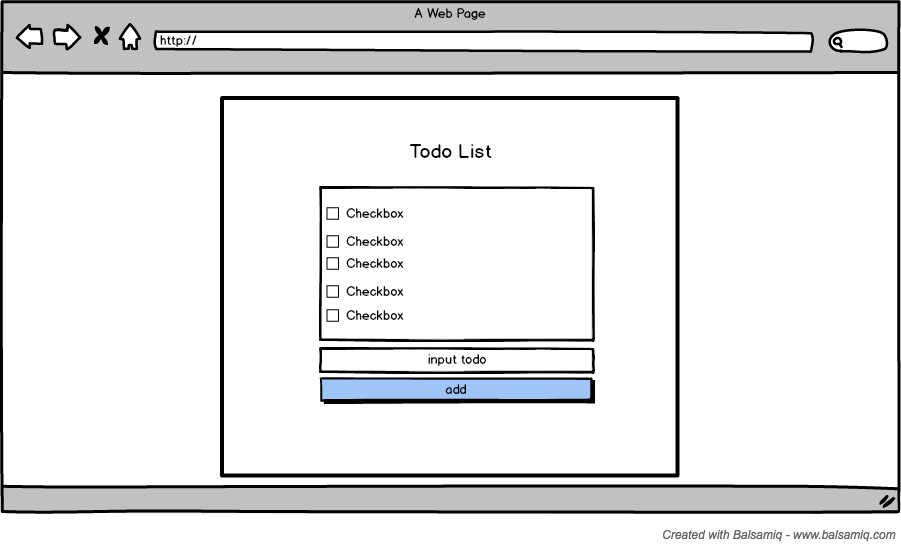

# My Todo App
## 만들면서 느낀점
일단 여기서 마무리 한다.

1. 역시 직접 만들어봐야 안다.
2. 뭘 알았냐면 yarn start 말고는 개뿔도 모르고 있었다는점
3. 리덕스 없는 리액트는 쉽다고 생각했는데 개뿔 안쉬웠다는점
4. 실제 백지에서 그려나가는게 졸라 힘들다는점
5. 컴포넌트 구조를 어떻게 짜야할지 막막했다는점, 경험이 더 필요하다는점
6. 그리고 처음에 계획했던거랑 다르게 추가기능을 넣고있으니까 프로젝트가 마무리가 안된다는점
7. 다음에 직접 만들어보는 프로젝트는 구조설계랑 기능 설계를 확실히 설정하고 시작해야겟따는 점이다.
8. 막 TIL 이랑 개별 프로젝트들이랑 마크다운 쓰는것도 겹치니까 중구난방되고 쓰다말고 막 난장판이야
9. 여튼 조금 찝찝하지만 리액트만으로 투두리스트 만들기는 여기서 종료
10. 어우 찝찝해 
## Make this!



## create-react-app
```
$ create-react-app my-todo-app
```

## 불필요한 파일 삭제
> src / App.test.js, logo.svg, index.css, App.css

## 컴포넌트 분리해보기

Todo-list 앱을 만들기 위해 필요한 컴포넌트를 알아보자
- TodoInput : 추가할 내용을 적을수 있는 인풋 과 추가 버튼 을 갖고있는 컴포넌트
- TodoItem : 할일, 체크박스와 내용, 삭제 버튼을 갖고있는 컴포넌트
- TodoList : TodoItem 컴포넌트를 담고있는 컴포넌트
- App : 각 컴포넌트를 감싸는 컴포넌트, State 관리

### 컴포넌트를 분리하는 기준은 무엇일까?

Class 컴포넌트, Functional 컴포넌트 어떤 것을 사용해서 컴포넌트를 구성해야 할까

[리액트(React) 이해 기초 - Component vs PureComponent vs Functional Component](https://www.vobour.com/%EB%A6%AC%EC%95%A1%ED%8A%B8-react-%EC%9D%B4%ED%95%B4-%EA%B8%B0%EC%B4%88-component-vs-purecomp)

- lifecycle, ref, state관리를 위해서는 class component
- 그 외에는 functional component


## Event Handling
- [https://reactjs.org/docs/handling-events.html](https://reactjs.org/docs/handling-events.html)

1. 컴포넌트 내에서 함수를 작성한다.
2. 작성한 함수와 클래스 컴포넌트를 바인딩한다.
3. 바인딩한 함수를 사용한다.
4. 바인딩한 함수를 하위 컴포넌트로 보낸다.
5. 하위 컴포넌트에서는 prop로 사용할수 있다.

## Form Control
- [https://reactjs.org/docs/forms.html](https://reactjs.org/docs/forms.html)

## Componet Life Cycle
- 마무리 못한자의 흔적